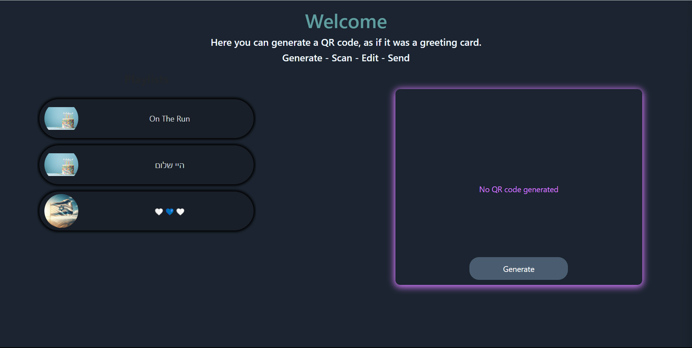
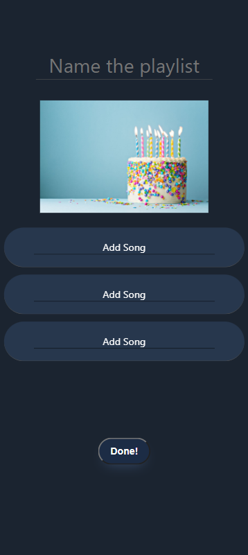

# **Sound Card Web App**

🎵 Welcome to Sound Card – a delightful web app that lets you create personalized greeting cards with custom soundtracks using QR codes! 🎉

## Overview

Sound Card is a project that brings a twist to traditional greeting cards. It allows users to compose a heartfelt message and pair it with a specially curated soundtrack. The recipient can then scan the QR code on the card using their mobile device to enjoy the personalized message and music.

### Features

* **QR Code Generation**: Utilize the admin page to effortlessly generate QR codes for your         personalized greeting cards.
* **Mobile Compatibility**: While the main web app should be accessed on a computer, the QR code can be scanned and edited on any mobile device with a camera.
* **YouTube Integration**: Seamlessly integrate the YouTube Data API for searching and playing songs to enhance the soundtrack selection.

## Tech Stack

* **Server**: Developed using Node.js for an efficient backend.
* **Client**: Built with React for a dynamic and responsive user interface.
* **Database**: MongoDB stores the necessary data to ensure a smooth user experience.
* **API**: Leverages the power of YouTube Data API for an extensive library of songs.

## Usage

1. Access the main web app on your computer or laptop (or another device, as long as you can use your phone to scan) by [clicking here](https://rad-pony-74f358.netlify.app/)
2. Use the admin page to generate QR codes for your greeting card.
3. Scan the QR code with your mobile device to access and edit the personalized message and soundtrack.

## Installation
To get started, follow these simple steps:

1. Clone The repository:
    `git clone https://github.com/TomBer101/PlaylistApp`
2. Install dependencies for the server:
    ```
    cd PlaylistApp/PlaylistServer
    npm install
    npm start
    ```
3. Install dependencies for the client:
    ```
    cd ../web-client
    npm install
    npm start
    ```

## Screenshots

### Admin Page


### Main App



Enjoy creating and sharing personalized Sound Cards with your loved ones! 💌🎶
Feel free to reach out if you have any questions or encounter issues. Happy coding! 😊✨


